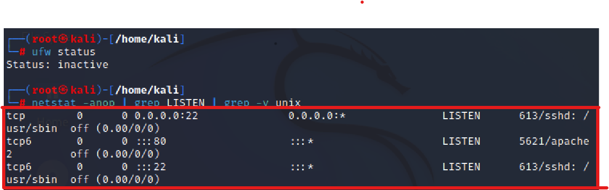
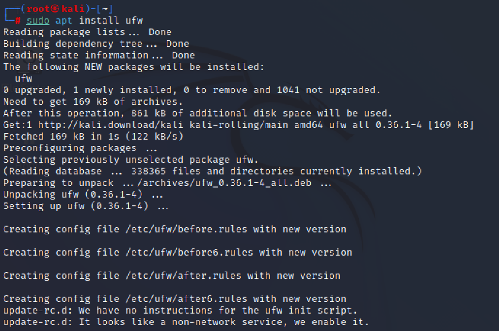

# 基于 Scapy 编写端口扫描器

## 实验目的

- 掌握网络扫描之端口状态探测的基本原理

## 实验环境

- python + scapy

- 网关：Debian

- 攻击者：Attacker-kali

- 受害者：Victim-kali  

## 实验要求

- [x] 禁止探测互联网上的 IP ，严格遵守网络安全相关法律法规

- [x] 完成以下扫描技术的编程实现
    - TCP connect scan / TCP stealth scan

    - TCP Xmas scan / TCP fin scan / TCP null scan

    - UDP scan

- [x] 上述每种扫描技术的实现测试均需要测试端口状态为：开放、关闭 和 过滤 状态时的程序执行结果

- [x] 提供每一次扫描测试的抓包结果并分析与课本中的扫描方法原理是否相符？如果不同，试分析原因；

- [x] 在实验报告中详细说明实验网络环境拓扑、被测试 IP 的端口状态是如何模拟的

- [x] （可选）复刻 nmap 的上述扫描技术实现的命令行参数开关

## 实验过程

#### 网络拓扑

| GateWay | Attacker-Kali | Victim-Kali |
| ------- | ------------- | ----------- |
| 172.16.111.1 | 172.16.111.133 | 172.16.111.104 |

#### 端口状态设置

- 查看当前防火墙的状态和现有规则

        ufw status

- 关闭状态：对应端口没有开启监听, 防火墙没有开启

        ufw disable

- 开启状态：对应端口开启监听，防火墙处于关闭状态

  - apache2基于TCP, 在80端口提供服务
  
        systemctl start apache2 # port 80

  - DNS服务基于UDP,在53端口提供服务

        systemctl start dnsmasq # port 53

- 过滤状态：对应端口开启监听, 防火墙开启

        ufw enable && ufw deny 80/tcp
        ufw enable && ufw deny 53/udp

#### TCP connect scan

##### 原理

- `TCP connect scan`先发送一个`S`，然后等待回应。

- 如果有回应且标识为`RA`，说明目标端口处于关闭状态；

- 如果有回应且标识为`SA`，说明目标端口处于开放状态。这时`TCP connect scan`会回复一个`RA`，在完成三次握手的同时断开连接。

##### 代码

    #! /usr/bin/python
 
    from scapy.all import *
 
    src_port = RandShort()
    dst_ip = "172.16.111.133"
    dst_port=80
 
    resp = sr1(IP(dst=dst_ip)/TCP(sport=src_port,dport=dst_port,flags="S"),timeout=10)

    if resp is None:
        print("Filtered")
    elif(resp.haslayer(TCP)):
        if(resp.getlayer(TCP).flags == 0x12):
            send_rst = sr(IP(dst=dst_ip)/TCP(sport=src_port,dport=dst_port,flags="AR"),timeout=10)
            print("Open")
        elif (resp.getlayer(TCP).flags == 0x14):
            print("Closed")

在虚拟机victim-kali上写入代码，保存为`tcp_connect_scan.py`文件：

##### Closed

attacker-kali防火墙关闭：

attacker-kali关闭80端口的监听：

在victim-kali运行代码，查看结果：

在attacker-kali抓取数据包：

分析数据包：

接收到RST/ACK数据包，说明80端口处于关闭状态

nmap复刻结果：

##### Open

attacker-kali防火墙关闭，开启80端口的监听：

在victim-kali运行代码，查看结果：

在attacker-kali抓取并分析数据包：

完成了三次握手，说明端口开放

nmap复刻结果：

##### Filtered

attacker-kali防火墙开启，并过滤80端口：

在victim-kali运行代码，查看结果：

在attacker-kali抓取并分析数据包：

只接收到一个TCP包，说明80端口处于过滤状态

nmap复刻结果：

#### TCP Xmas scan

##### 原理

- 一种隐蔽性扫描。仅发送 FIN 包，它可以直接通过防火墙
  - 当处于端口处于关闭状态时，会回复一个RST包；
  - 如果端口是开放或过滤状态则对 FIN 包没有任何响应。

##### 代码
    #! /usr/bin/python

    from scapy.all import *

    dst_ip = "172.16.111.133"
    dst_port = 80

    resp = sr1(IP(dst=dst_ip)/TCP(dport=dst_port,flags="FPU"),timeout=10)

    if resp is None:
        print("Open|Filtered")

    elif(resp.haslayer(TCP)):
        if(resp.getlayer(TCP).flags == 0x14):
            print("Closed")
    
    elif(resp.haslayer(ICMP)):
        if(int(resp.getlayer(ICMP).type)==3 and int(resp.getlayer(ICMP).code) in [1,2,3,9,10,13]):
            print("Filtered")

在虚拟机victim-kali上写入代码，保存为`tcp_xmas_scan.py`文件：

##### Closed

防火墙关闭，80端口未开启监听：

在victim-kali运行代码，并在attacker-kali抓取并分析数据包：

发现RST/ACK数据包，说明端口关闭

nmap复刻结果：

##### Open

防火墙关闭，80窗口开启监听：

在victim-kali运行代码，并在attacker-kali抓取并分析数据包：

attacker-kali收到一个TCP包，没有响应，说明端口处于开启/过滤状态

nmap复刻结果：

##### Filtered

attacker-kali防火墙开启，并过滤80端口：

在victim-kali运行代码，并在attacker-kali抓取和分析数据包：

attacker-kali只收到一个TCP包，没有响应，说明端口处于过滤或开启状态

nmap复刻结果：

#### UDP scan

##### 原理

- 一种开放式扫描，通过发送零字节的UDP包进行扫描。
  - 当收到UDP回复时，该端口为开启状态；若没有回复，可能为开启/过滤状态。
  - 收到ICMP端口不可达错误，说明端口关闭

##### 代码

    from scapy.all import *

    dst_ip = "172.16.111.133"
    dst_port = 53

    resp = sr1(IP(dst=dst_ip)/UDP(dport=dst_port),timeout=10)
    
    if resp is None:
        print("Open|Filtered")

    elif(resp.haslayer(UDP)):
        print("Open")

    elif(resp.haslayer(ICMP)):
        if(int(resp.getlayer(ICMP).type)==3 and int(resp.getlayer(ICMP).code)==3):
            print("Closed") 
        elif(int(resp.getlayer(ICMP).type)==3 and int(resp.getlayer(ICMP).code) in [1,2,9,10,13]):
            print("Filtered")

在虚拟机victim-kali上写入代码，保存为`udp_scan.py`文件：  

##### Closed

防火墙关闭，53端口未开启监听：

在victim-kali运行代码，并在attacker-kali抓取并分析数据包：

attacker-kali发送了ICMP端口不可达的数据包，说明端口处于关闭状态

nmap复刻结果`sudo nmap -sU -p 53 172.16.111.133`：

##### Open

安装`dnsmasq.service`。防火墙关闭，53窗口开启监听：

在victim-kali运行代码，并在attacker-kali抓取并分析数据包：

Attacker-kali接受了victim-kali发送的UDP数据包并发送了响应包，说明端口处于开启状态

nmap复刻结果：

##### Filtered

开启防火墙，并过滤经过53端口的所有包：

在victim-kali运行代码，并在attacker-kali抓取和分析数据包：

Attacker-kali接收到victim-kali发送的UDP数据包，但没有做出响应，说明端口处于过滤状态

nmap复刻结果：

## 实验问题

#### kali没有获得root权限

##### 问题截图

##### 解决方法

使kali获得root权限

问题解决。

#### ufw无法安装

##### 问题截图

##### 解决方法

更新apt：

    sudo apt update

安装ufw：

    sudo apt install ufw

安装成功，问题解决：

#### dnsmasq无法安装

##### 问题截图

kali没有安装dnsmasq.service：

执行`apt install dnsmasq`后仍然出现问题：

##### 解决方法

根据图中提示信息：

执行`apt --fix-broken install`后：

dnsmasq.service安装成功：

## 参考资料

[电子课本](https://c4pr1c3.github.io/cuc-ns/chap0x05/main.html)

[ufw无法安装](https://www.nixcraft.com/t/e-package-ufw-has-no-installation-candidate-on-debian-linux/3726/2)

[kali下创建文件](https://blog.csdn.net/qq_42133828/article/details/84451655)

[基于scapy的端口扫描器](https://blog.csdn.net/think_ycx/article/details/50898096)